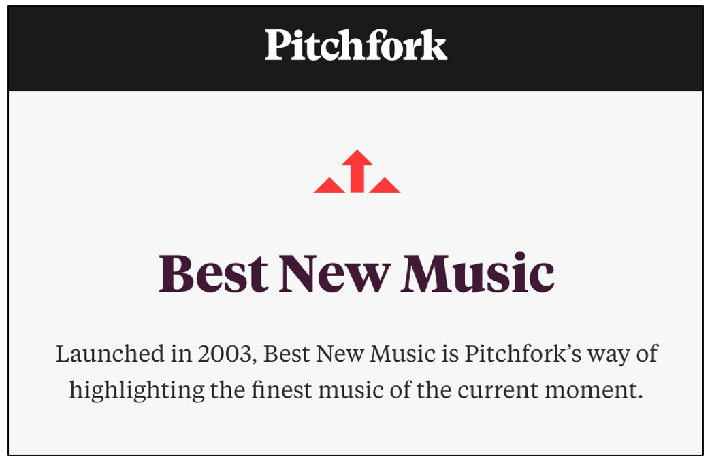
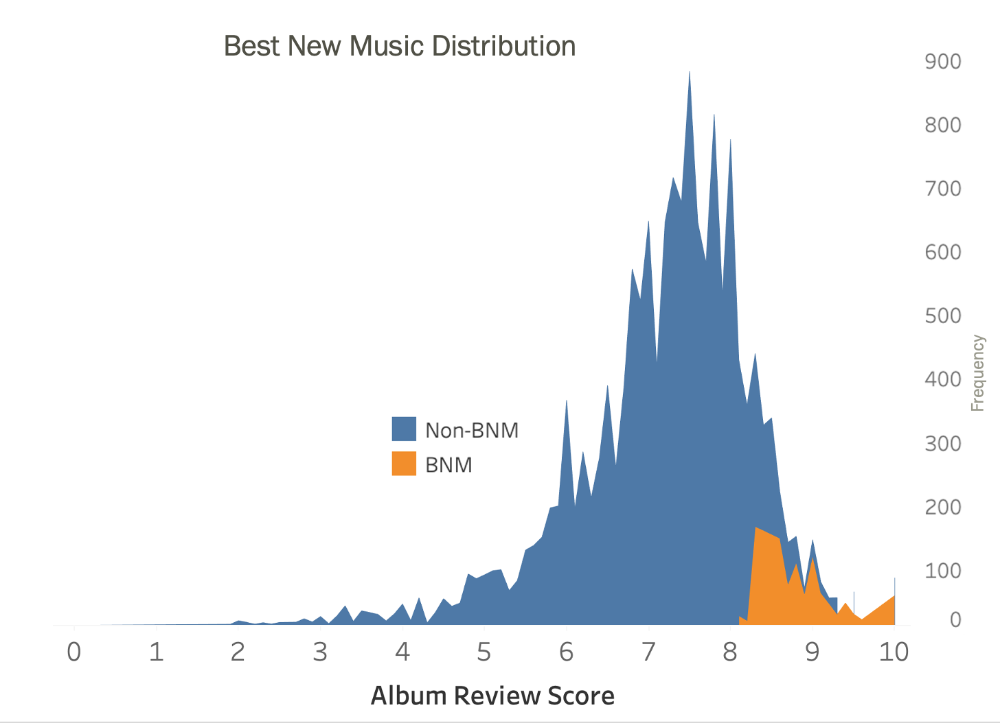
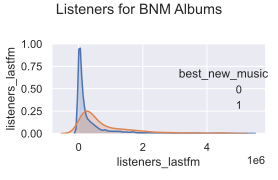
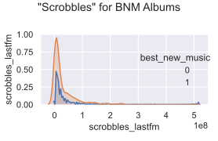
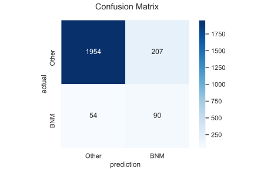
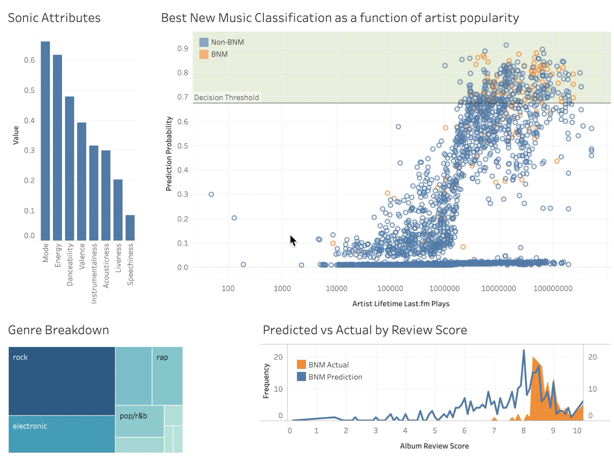
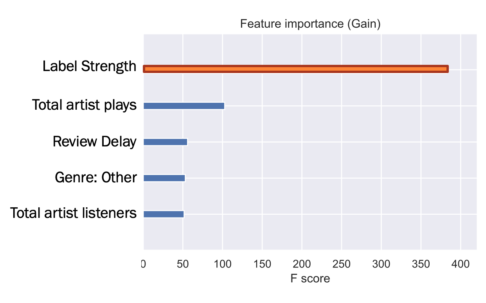
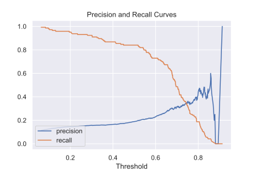

# Predicting Pitchfork Reviews

#### Analyzing critical success in the music industry vis-à-vis classifying Pitchfork’s Best New Music selections

Max Currier

## Background

Pitchfork.com is an established music blog that reviews artists both famous and relatively unknown. A review from Pitchfork can put a lot of eyeballs on a new album, and if a release is classified as "Best New Music" it can do an enormous amount of good for an emerging artist. With that in mind, I thought it would be insightful to look deeper into why a particular release gets this high accolade.

## Methodology

The goal of this project was to analyze Pitchfork music reviews in order to gain key insights on what determines critical success on a major, influential platform. To accomplish this, **I used a gradient boosting decision tree algorithm (XGBoost) to predict whether or not a Pitchfork-reviewed album will be categorized as “Best New Music”**

All data procured from the following sources:

* 18,393 album reviews from 1999 to 2017 from [Kaggle](https://www.kaggle.com/nolanbconaway/pitchfork-data)
  * Best New Music classification, genre, review publication date, record label affiliation
  * Queried SQLite Database with [SQLite3](https://datacarpentry.org/python-ecology-lesson/09-working-with-sql/index.html) module

* 1,466,083 records of artist-level data from [Million Song Dataset](http://millionsongdataset.com/lastfm/)
  * Unique listeners and total plays per artist
  * CSV

* 166,589 records of track-level data from the [Spotify API](https://developer.spotify.com/documentation/web-api/)
  * Sonic features (key, tempo, danceability, etc.)
  * Queried directly from API with [Spotipy](https://spotipy.readthedocs.io/en/2.13.0/) module

## Best New Music Distribution

Challenges with classifying Best New Music included 1) that I can't use review score as a feature, since score and BNM classification are effectively two sides of the same coin, and 2) the BNM was underrepresented 15:1 in the data. To overcome this issue, resampled the data and adjusted the decision threshold.

## Key Features of the Modeling

I A/B tested many feature combinations using F1 and ROC AUC to determine which were most effective, and it turns out I was able to get the best signal from
* Unique listeners
* Total plays ("Scrobles")
* “Label Strength”

Other features provided moderate class separation at best. Here you can see the separation of a couple of the stronger features.

## Results

The model achieved the following results:
* 0.887 accuracy
* F1 = 0.408
* BNM Precision = 0.303
* BNM Recall = 0.625
* ROC AUC = 0.765

Analyzing these results, it is worth mentioning that class imbalance means that high accuracy is deceptive.  By looking at the confusion matrix it is clear there is a preponderance of false positives.

That being said, art and criticism are subjective, so this was a difficult problem to classify!

## Dashboard

To visualize the results of my model in greater detail, I built [this interactive Tableau dashboard](https://public.tableau.com/profile/max.currier#!/vizhome/PitchforkBestNewMusicClassifier/Dashboard1?publish=yes) that allows users to drill down into the model's predictions to see how it performed at a genre-level, or even at the *individual artist or album level*. Warning: this dashboard is really fun to play with if you're familiar with the records that have been reviewed. Clicking on genres or speific albums will also show you their Spotify sonic attributes, which are metrics that Spotify records about all songs that are released through the platform and include things like "energy", "danceability", and "instrumentalness."

Here is a still image of the dashboard for reference as well.

## Key Takeaways

By analyzing the feature importance of each feature in the model we can determine what features were most important to an album being classified as "Best New Music." I used the most and least important features inform the following insights:

1. **You can judge an album by its label.**
  * Affiliation with more popular labels matters to reviewers

2. **Clout carries serious weight.**
  * Albums by artists with many more lifetime listens more likely to receive praise

3. **Reviews are subjective.**
  * Sonic attributes don’t have a significant impact

  

## Future work

Eventually, I would like to revisit this project and improve a few things, namely the model's ability to predict emerging artists and the model's overall precision. I suspect that adding new datasets may have a positive impact on these issues.

## Tools
* Jupyter Notebook
* Tableau
* Atom
* AWS EC-2
* SQLite
* Pandas
* Numpy
* Matplotlib
* Seaborn
* Imblearn
* Scikit-learn  
* XGBoost
*
